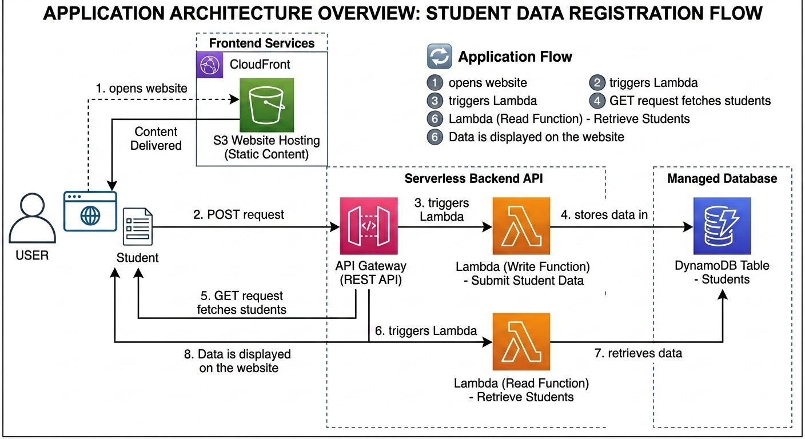
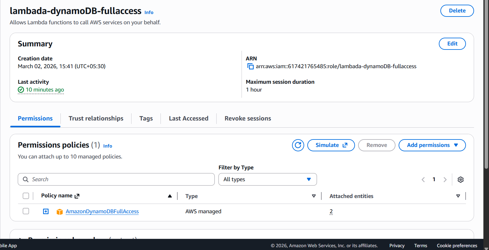
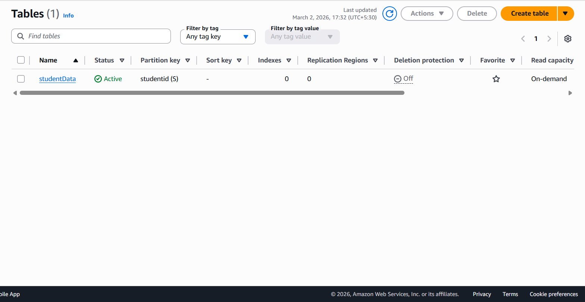
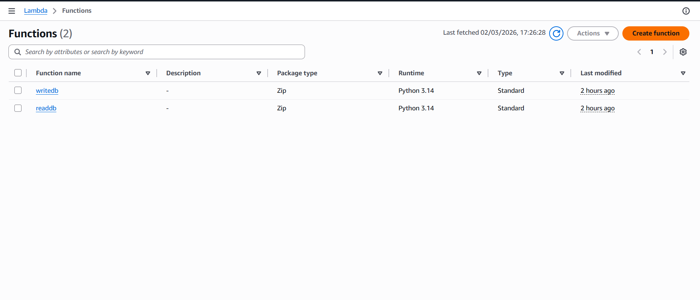
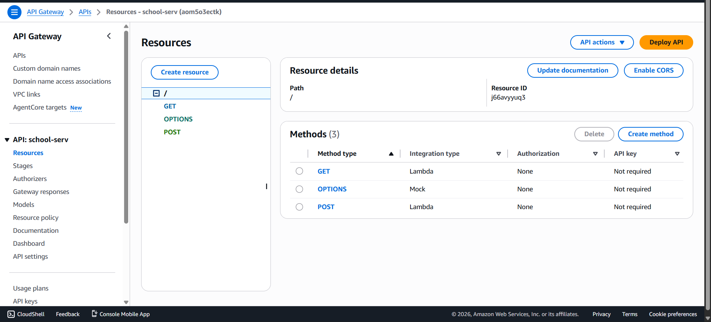
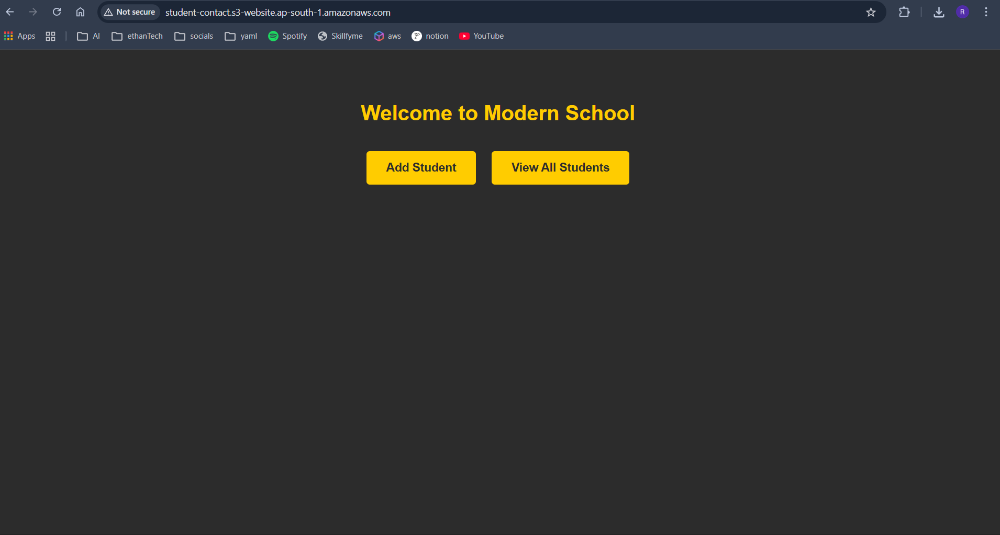
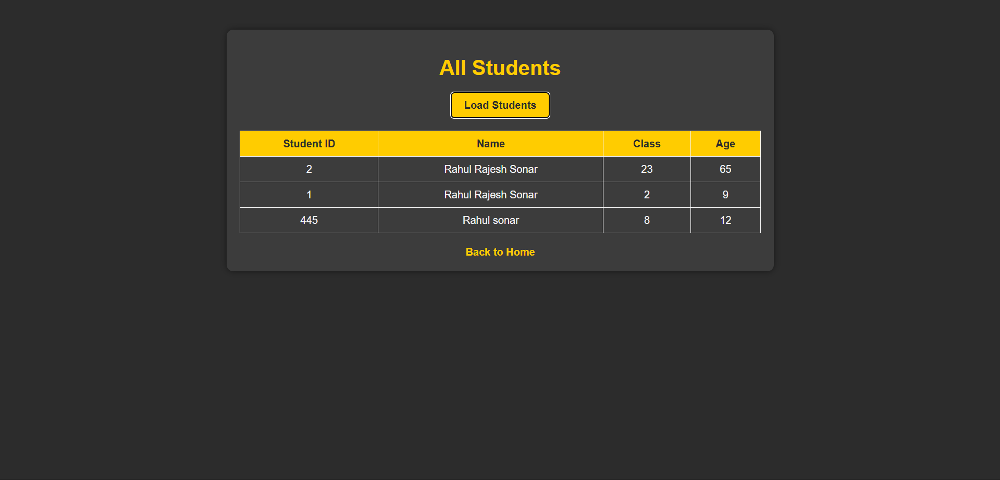
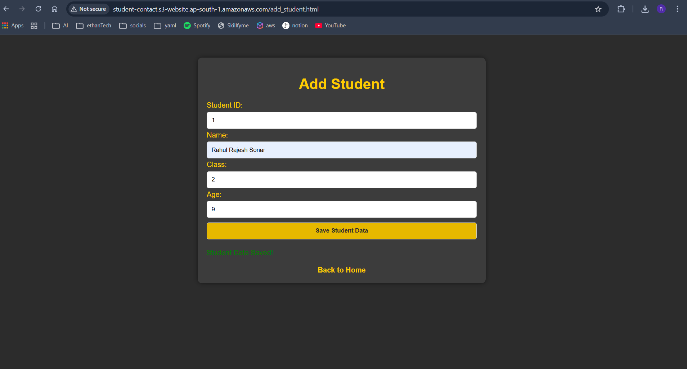

# 🎓 Serverless Student Enrollment System on AWS

A fully serverless Student Registration System built using AWS services — no EC2 instances, no server management.
---

## 📌 Table of Contents

- [Introduction](#introduction)
- [Architecture Overview](#architecture-overview)
- [AWS Services Used](#aws-services-used)
- [Prerequisites](#prerequisites)
- [Project Structure](#project-structure)
- [Setup Guide](#setup-guide)
  - [Step 1: Create S3 Bucket](#step-1-create-s3-bucket-frontend-hosting)
  - [Step 2: Create IAM Role](#step-2-create-iam-role-for-lambda)
  - [Step 3: Create DynamoDB Table](#step-3-create-dynamodb-table)
  - [Step 4: Create Lambda Functions](#step-4-create-lambda-functions)
  - [Step 5: Create API Gateway](#step-5-create-api-gateway)
  - [Step 6: Configure S3 Permissions & CORS](#step-6-configure-s3-permissions--cors)
- [Final Outcome](#-final-outcome)
- [Conclusion](#conclusion)

---

## Introduction

Modern applications demand scalability, high availability, and minimal infrastructure management. This project builds a **fully serverless Student Registration System** using AWS services.

**The application allows:**
- Students to register using: Student ID, Name, Class, and Age
- Users to view all registered students

All powered using **AWS serverless architecture** — no servers to provision or maintain.

---

## Architecture Overview

<!-- TODO: Upload your architecture diagram image here -->
<!-- Replace the placeholder below with your actual image path -->
> 📷 **Architecture Diagram**
>
> 

### Application Flow

```
User opens S3-hosted website
        ↓
Student submits form (POST request)
        ↓
API Gateway receives request
        ↓
API Gateway triggers Lambda (Write Function)
        ↓
Lambda stores data in DynamoDB
        ↓
GET request fetches students
        ↓
Lambda (Read Function) retrieves data
        ↓
Data displayed on website
```

---

## AWS Services Used

| Service | Purpose |
|---|---|
| **Amazon S3** | Frontend hosting (Static Website Hosting) |
| **AWS Lambda** | Backend logic — Write & Read functions |
| **Amazon DynamoDB** | NoSQL database to store student records |
| **Amazon API Gateway** | Creates REST endpoints for GET & POST |
| **IAM Roles** | Securely allows Lambda to access DynamoDB |

---

## Prerequisites

- AWS Account
- Basic knowledge of HTML, JavaScript, REST APIs (GET & POST)
- Basic understanding of Lambda, DynamoDB, IAM, API Gateway

---

## Project Structure

```
student-registration-app/
│
├── index.html           # Main frontend page
├── script.js            # Main JS with API Invoke URL
├── add-student.js       # Handles POST request (register student)
└── fetch-students.js    # Handles GET request (fetch all students)
```

---

## Setup Guide

### Step 1: Create S3 Bucket (Frontend Hosting)

**Path:** AWS Console → S3 → Create Bucket

**Configuration:**
- Provide a unique bucket name
- Disable **Block Public Access**
- Enable **Static Website Hosting**
  - Index document: `index.html`

**Upload files:**
- `index.html`
- `script.js`
- `add-student.js`
- `fetch-students.js`

---

### Step 2: Create IAM Role for Lambda

**Path:** IAM → Roles → Create Role

**Configuration:**
- Trusted entity: **Lambda**
- Attach policy: `AmazonDynamoDBFullAccess` *(or a custom least-privilege policy)*

This role allows Lambda to read from and write to DynamoDB.

<!-- TODO: Upload your IAM role screenshot here -->
> 📷 **Screenshot**
>
> 

---

### Step 3: Create DynamoDB Table

**Path:** DynamoDB → Create Table

**Configuration:**
- Table Name: `Students`
- Partition Key: `studentId` (String)
- Keep other settings default

<!-- TODO: Upload your DynamoDB table screenshot here -->
> 📷 **Screenshot**
>
> 

---

### Step 4: Create Lambda Functions

**Path:** Lambda → Create Function

#### Lambda Function 1 – Write Database (`writeDB`)

**Purpose:** Accept student details and store record in DynamoDB.

```python
import json
import boto3

# Create a DynamoDB object using the AWS SDK
dynamodb = boto3.resource('dynamodb')
# Use the DynamoDB object to select our table
table = dynamodb.Table('studentData')

def lambda_handler(event, context):
    student_id = event['studentid']
    name = event['name']
    student_class = event['class']
    age = event['age']

    response = table.put_item(
        Item={
            'studentid': student_id,
            'name': name,
            'class': student_class,
            'age': age
        }
    )

    return {
        'statusCode': 200,
        'body': json.dumps('Student data saved successfully!')
    }
```

#### Lambda Function 2 – Read Database (`readDB`)

**Purpose:** Fetch all students from DynamoDB and return data in JSON format.

```python
import json
import boto3

def lambda_handler(event, context):
    dynamodb = boto3.resource('dynamodb', region_name='us-west-1')
    table = dynamodb.Table('studentData')

    response = table.scan()
    data = response['Items']

    while 'LastEvaluatedKey' in response:
        response = table.scan(ExclusiveStartKey=response['LastEvaluatedKey'])
        data.extend(response['Items'])

    return data
```

<!-- TODO: Upload your Lambda functions screenshot here -->
> 📷 **Screenshot**
>
> 


---

### Step 5: Create API Gateway

**Path:** API Gateway → Create HTTP API

#### Create Routes

| Route | Method | Integration |
|---|---|---|
| `/add-student` | POST | WriteDB Lambda |
| `/get-students` | GET | ReadDB Lambda |

**Steps:**
1. Deploy the API
2. Enable CORS for both POST and GET routes
3. Deploy again and copy the **Invoke URL**
4. Update the Invoke URL in your `script.js`

<!-- TODO: Upload your API Gateway screenshot here -->
> 📷 **Screenshot**
>
> 


---

### Step 6: Configure S3 Permissions & CORS

#### Enable Static Website Hosting
S3 → Properties → Static Website Hosting → **Enable**

#### Add Bucket Policy
S3 → Permissions → Bucket Policy

```json
{
    "Version": "2012-10-17",
    "Statement": [
        {
            "Sid": "Statement1",
            "Effect": "Allow",
            "Principal": "*",
            "Action": "s3:GetObject",
            "Resource": "<your-bucket-arn>/*"
        }
    ]
}
```

#### Configure CORS
S3 → Permissions → CORS

```json
[
    {
        "AllowedHeaders": ["*"],
        "AllowedMethods": ["GET", "POST", "PUT", "DELETE", "HEAD"],
        "AllowedOrigins": ["*"],
        "ExposeHeaders": ["ETag"],
        "MaxAgeSeconds": 3000
    }
]
```

---

## 🎯 Final Outcome

<!-- TODO: Upload your final working website screenshot here -->
> 📷 **Final Website Screenshot**
>
> 
>  
>  


After completing all steps:

- ✅ Website is live on S3
- ✅ Students can register successfully
- ✅ Data stored securely in DynamoDB
- ✅ GET API fetches all registered students
- ✅ Fully scalable serverless architecture

---

## Conclusion

This project successfully builds a **Serverless Student Registration System** on AWS without managing any servers.

By combining:
- **Amazon S3** — Frontend Hosting
- **AWS Lambda** — Backend Logic
- **Amazon DynamoDB** — Database
- **API Gateway** — API Management
- **IAM** — Security & Permissions

We created a **scalable, cost-efficient, and production-ready** application — ideal for beginners looking for hands-on AWS serverless experience.

---

## 📎 Resources

- [AWS Lambda Docs](https://docs.aws.amazon.com/lambda/)
- [Amazon DynamoDB Docs](https://docs.aws.amazon.com/dynamodb/)
- [Amazon API Gateway Docs](https://docs.aws.amazon.com/apigateway/)
- [Amazon S3 Static Hosting](https://docs.aws.amazon.com/AmazonS3/latest/userguide/WebsiteHosting.html)

---

> 📝 *Built as part of the AWS Cloud Project Bootcamp — Learning Journey*
